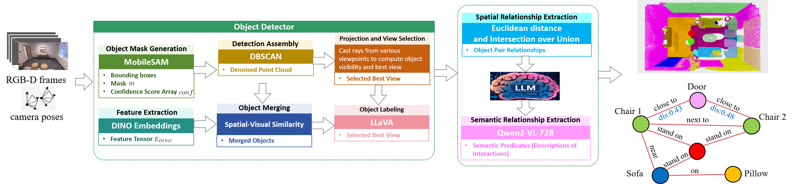
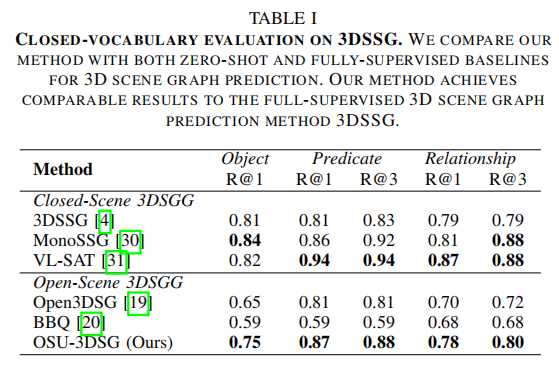
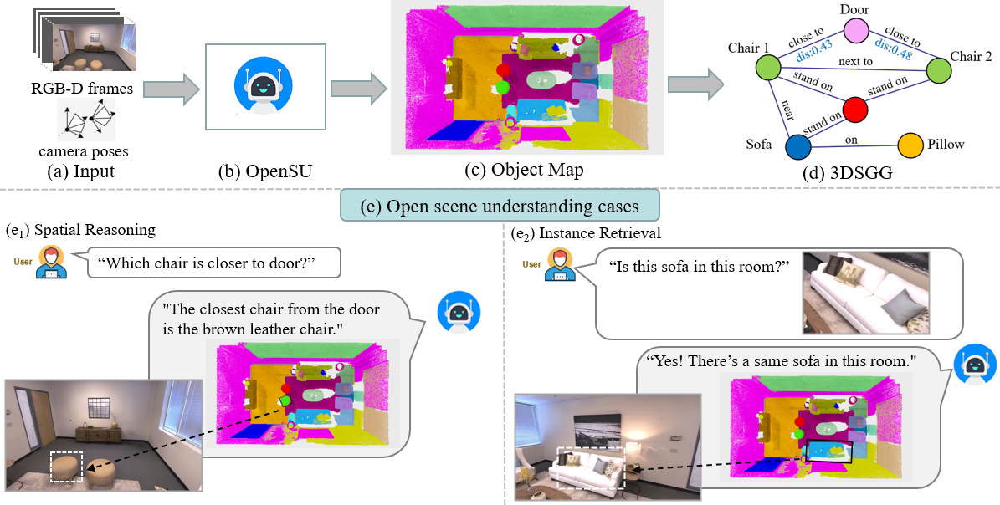

<p align="center">

  <h1 align="center">Open-Scene Understanding-oriented 3D Scene Graph Generation</h1>
  
  <!-- <p align="center">
    <a href="https://github.com/YuansuHao">Yuansu Hao</a>
  </p> -->

  <!-- <h4 align="center"><a href="http://arxiv.org/abs/2406.07113">arXiv</a> | <a href="https://github.com/YuansuHao/OSU-3DSG">Code</a></h4>
  <div align="center"></div> -->

## News
- [2025.03] We are pleased to inform you that our paper has been accepted at ICME 2025! 🎉
- [2025.02] Release the initial version of **OSU-3DSG**. 
<p align="center">

</p>


## Introduction

- **OSU-3DSG** is an open-scene 3D scene graph framework designed for open-world environments. Our model incorporates two key innovations:
  - (1) an open-scene 3D object detector that identifies objects from RGB-D frames without relying on fixed object classes or labeled datasets
  - (2) an open-vocabulary 3D scene graph generation method that uses a pre-trained vision-language model to generate relationship predicates, allowing for flexible scene understanding. 

<p align="center">

</p>

## Example Outputs
- **Open Scene Understanding cases based on OSU-3DSG on Replica**

<p align="center">
    
</p>


## Usage

### System Requirements
- **Recommended GPUs**: 1xR8000 (48G) to run local vLLM
- **Software**:
  - **Python**: 3.8 or higher
  - **PyTorch**: Version 2.5.1
  - **CUDA**: Version 11.8

**Note**: Ensure that your system meets these requirements for optimal performance.

### Data Preparation

#### 3RScan
Please make sure you agree the [3RScan Terms of Use](https://forms.gle/NvL5dvB4tSFrHfQH6) first, and get the download script and put it right at the 3RScan main directory.
Then run
```
cd data
cd 3rscan
# prepare ground truth
bash preparation.sh
```

#### Replica
Download the Replica RGB-D scan dataset using the downloading [script](https://github.com/cvg/nice-slam/blob/master/scripts/download_replica.sh) in Nice-SLAM. It contains rendered trajectories using the mesh models provided by the original Replica datasets.


### Environment Setup
```
# if you don't have miniconda
source setup_conda.sh 

# setup
source setup.sh

mkdir data
ln -s /path/to/your/3RScan ./data/

source Init.sh # This will set PYTHONPATH and activate the environment for you.
```
### Prerequisites

Before running OSU-3DSG, make sure you have obtained the checkpoints in [Prerequisites.md](./files/Prerequisites.md)

### Run OSU-3DSG

#### 3D Object Map

First, build 3D Object Map. Check config before run. Inside container call script:

```python
python3 objectmap.py --config_path=examples/configs/replica/room0.yaml #Replica
python3 objectmap.py --config_path=examples/configs/3rscan/scene1.yaml #3RScan
```

To visualize 3D object map:
```python
python3 visualize/show_objects.py --animation_folder=output
```

#### 3D Scene Graph 

##### Qwen2.5-VL

Setup [Qwen2.5-VL-72B-Instruct Model](https://huggingface.co/Qwen/Qwen2.5-VL-72B-Instruct/tree/main) and then generate 3D Scene Graph:

```python
# Qwen2.5-VL
python3 scenegraph.py --config_path=examples/configs/replica/room0.json --save_path=output/scenes #Replica
python3 scenegraph.py --config_path=examples/configs/3rscan/scene1.json --save_path=output/scenes #3RScan 
```

## Acknowledgement
We are grateful for the following awesome projects our OSU-3DSG arising from: [BBQ](https://github.com/linukc/BeyondBareQueries), [LLaVA](https://github.com/haotian-liu/LLaVA), [Qwen](https://github.com/QwenLM/Qwen2.5), [CLIP](https://github.com/openai/CLIP).

<!-- ## Citation
If you find this work helpful, please consider citing our work as:
```
@misc{linok2024barequeriesopenvocabularyobject,
      title={Beyond Bare Queries: Open-Vocabulary Object Grounding with 3D Scene Graph}, 
      author={Sergey Linok and Tatiana Zemskova and Svetlana Ladanova and Roman Titkov and Dmitry Yudin and Maxim Monastyrny and Aleksei Valenkov},
      year={2024},
      eprint={2406.07113},
      archivePrefix={arXiv},
      primaryClass={cs.CV},
      url={https://arxiv.org/abs/2406.07113}, 
}
``` -->

## Contact
Please create an issue on this repository for questions, comments and reporting bugs. Send an email to [Yuansu Hao](24s136079@stu.hit.edu.cn) for other inquiries.
