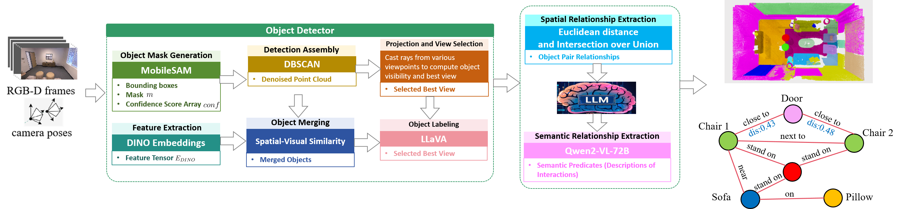

<p align="center">

  <h1 align="center">Open-Scene Understanding-oriented 3D Scene Graph Generation</h1>
  <!-- <p align="center">
    <a href="https://github.com/linukc">Linok Sergey</a>
    ·
    <a href="https://github.com/wingrune">Tatiana Zemskova</a>
    ·
    Svetlana Ladanova
    ·
    Roman Titkov
    ·
    Dmitry Yudin
    <br>
    Maxim Monastyrny
    ·
    Aleksei Valenkov
  </p> -->

  <!-- <h4 align="center"><a href="https://linukc.github.io/BeyondBareQueries/">Project</a> | <a href="http://arxiv.org/abs/2406.07113">arXiv</a> | <a href="https://github.com/linukc/BeyondBareQueries">Code</a></h4>
  <div align="center"></div> -->
</p>

<p align="center">

</p>

## Getting Started

### System Requirements
- **Recommended GPUs**: 1xR8000 (48G) to run local vLLM
- **Software**:
  - **Python**: 3.8 or higher
  - **PyTorch**: Version 2.5.1
  - **CUDA**: Version 11.8

**Note**: Ensure that your system meets these requirements for optimal performance.

### Data Preparation

#### 3RScan
Please make sure you agree the [3RScan Terms of Use](https://forms.gle/NvL5dvB4tSFrHfQH6) first, and get the download script and put it right at the 3RScan main directory.
Then run
```
cd data
cd 3rscan
# prepare ground truth
bash preparation.sh
```

#### Replica
Download the Replica RGB-D scan dataset using the downloading [script](https://github.com/cvg/nice-slam/blob/master/scripts/download_replica.sh) in Nice-SLAM. It contains rendered trajectories using the mesh models provided by the original Replica datasets.


### Environment Setup
```
# if you don't have miniconda
source setup_conda.sh 

# setup
source setup.sh

mkdir data
ln -s /path/to/your/3RScan ./data/

source Init.sh # This will set PYTHONPATH and activate the environment for you.
```
### Prerequisites

Before running OSU-3DSG, make sure you have obtained the following checkpoints:

#### MobileSAMv2
```bash 
gdown 1dE-YAG-1mFCBmao2rHDp0n-PP4eH7SjE -O ~/weights/mobilesamv2/weight.zip
unzip ~/weights/mobilesamv2/weight.zip -d ~/weights/mobilesamv2/
cp ~/MobileSAM/MobileSAMv2/PromptGuidedDecoder/Prompt_guided_Mask_Decoder.pt ~/weights/mobilesamv2/weight/
```
Or download manually:
- Download weight.zip from [Google Drive](https://drive.usercontent.google.com/download?id=1dE-YAG-1mFCBmao2rHDp0n-PP4eH7SjE&export=download&authuser=0).
- Extract the file and copy *Prompt_guided_Mask_Decoder.pt* to the weight folder.

#### VLM Model
Use `git-lfs` to download weights of [LLaVA-Vicuna-7B Model](https://huggingface.co/liuhaotian/llava-v1.6-vicuna-7b/tree/main) and [Qwen2.5-VL-72B-Instruct Model](https://huggingface.co/Qwen/Qwen2.5-VL-72B-Instruct/tree/main)::
```bash
git lfs install
git clone https://huggingface.co/liuhaotian/llava-v1.6-vicuna-7b
git clone https://huggingface.co/Qwen/Qwen2.5-VL-72B-Instruct
```
#### CLIP Model
Use `git-lfs` to download weights of [clip-vit-large-patch14-336](https://huggingface.co/openai/clip-vit-large-patch14-336/tree/main):
```bash
git lfs install
git clone https://huggingface.co/openai/clip-vit-large-patch14-336
```

The file structure looks like:
```
ckpt/
|–– llava-v1.6-vicuna-7b/
    |-- ...
|–– Qwen2.5-VL-72B-Instruct/
    |-- ...
|–– clip-vit-large-patch14-336/
    |-- dinov2_vits14_reg4_pretrain.pth
    |-- dinov2_vits14_reg4_linear_head.pth
|–– MobileSAMv2/
    |-- Prompt_guided_Mask_Decoder.pt
```


### Run OSU-3DSG

#### 3D Object Map

First, build 3D Object Map. Check config before run. Inside container call script:

```python
python3 main.py --config_path=examples/configs/replica/room0.yaml #Replica
python3 main.py --config_path=examples/configs/3rscan/scene1.yaml #3RScan
```

To visualize 3D object map:
```python
python3 visualize/show_objects.py --animation_folder=output
```

#### 3D Scene Graph 

##### Qwen2.5-VL

Setup [Qwen2.5-VL-72B-Instruct Model](https://huggingface.co/Qwen/Qwen2.5-VL-72B-Instruct/tree/main) and then generate 3D Scene Graph:

```python
# Qwen2.5-VL
python3 Triplet_Construction.py --config_path=examples/configs/replica/room0.json --save_path=output/scenes #Replica
python3 Triplet_Construction.py --config_path=examples/configs/3rscan/scene1.json --save_path=output/scenes #3RScan 
```

## Acknowledgement
We base our work on the following paper codebase: [BeyondBareQueries](https://github.com/linukc/BeyondBareQueries).

<!-- ## Citation
If you find this work helpful, please consider citing our work as:
```
@misc{linok2024barequeriesopenvocabularyobject,
      title={Beyond Bare Queries: Open-Vocabulary Object Grounding with 3D Scene Graph}, 
      author={Sergey Linok and Tatiana Zemskova and Svetlana Ladanova and Roman Titkov and Dmitry Yudin and Maxim Monastyrny and Aleksei Valenkov},
      year={2024},
      eprint={2406.07113},
      archivePrefix={arXiv},
      primaryClass={cs.CV},
      url={https://arxiv.org/abs/2406.07113}, 
}
``` -->

<!-- ## Contact
Please create an issue on this repository for questions, comments and reporting bugs. Send an email to [Linok Sergey](linok.sa@phystech.edu) for other inquiries. -->
